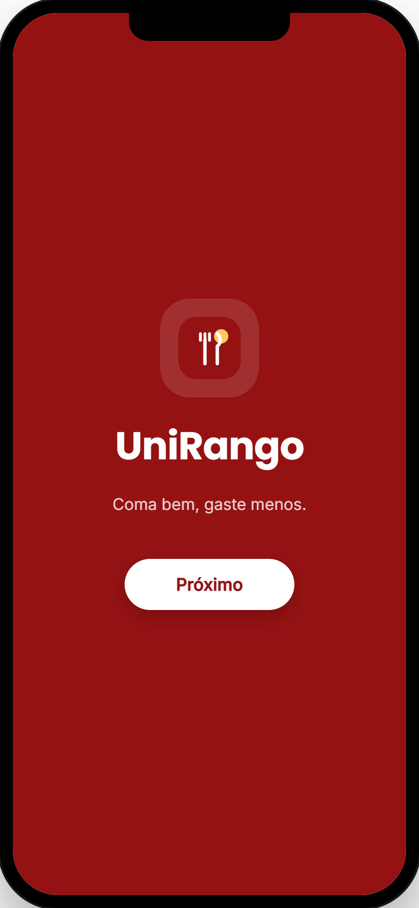
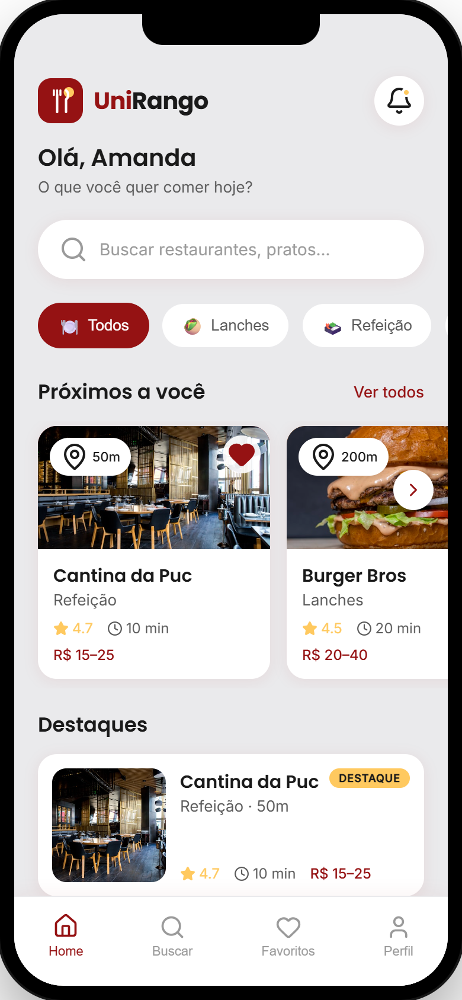
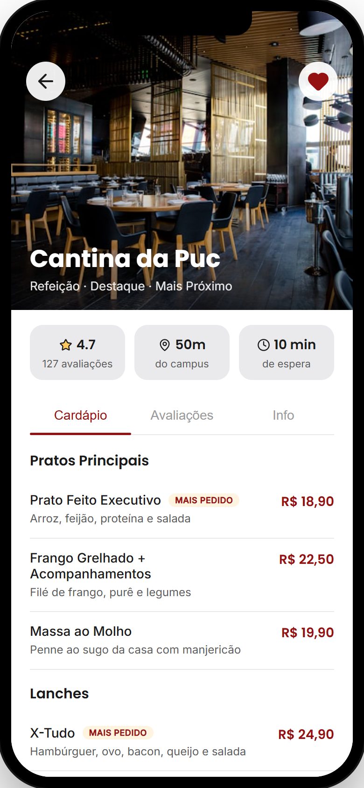
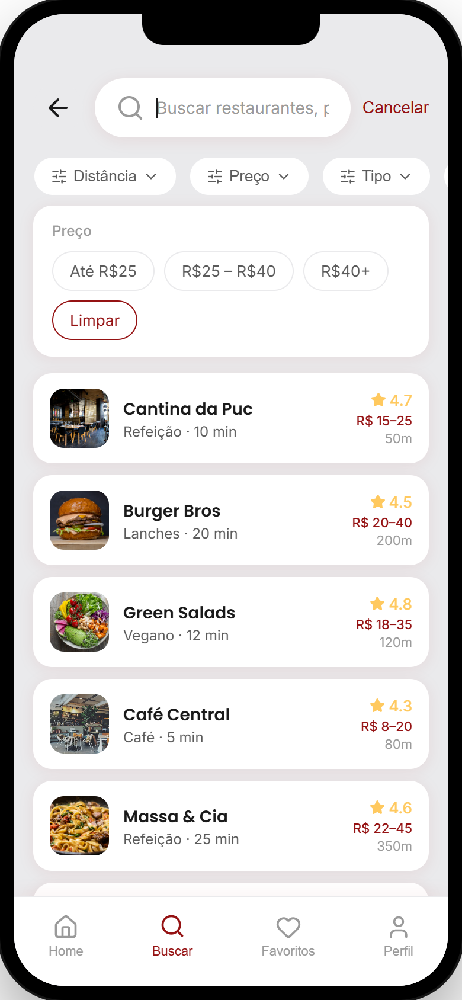
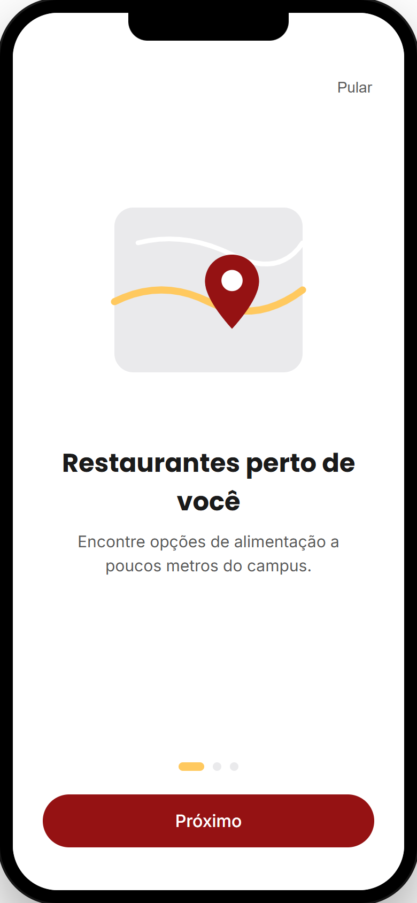
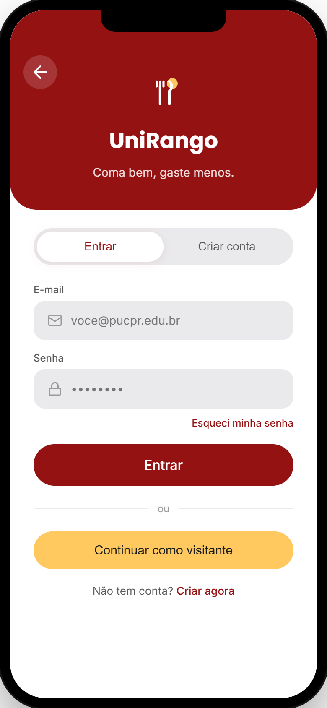
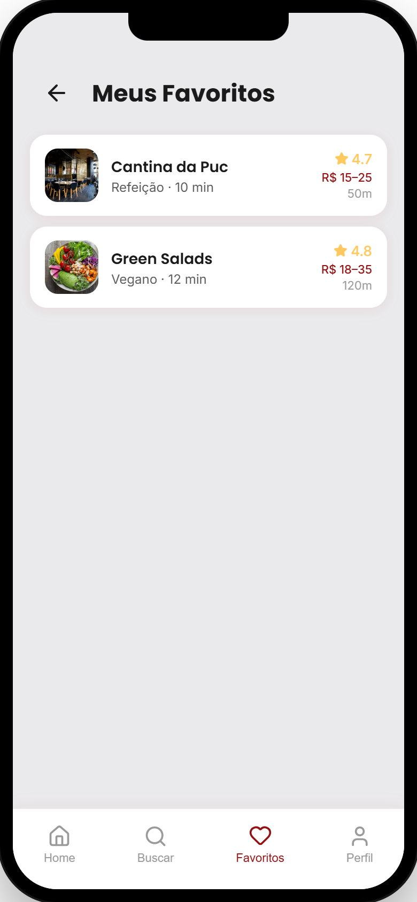
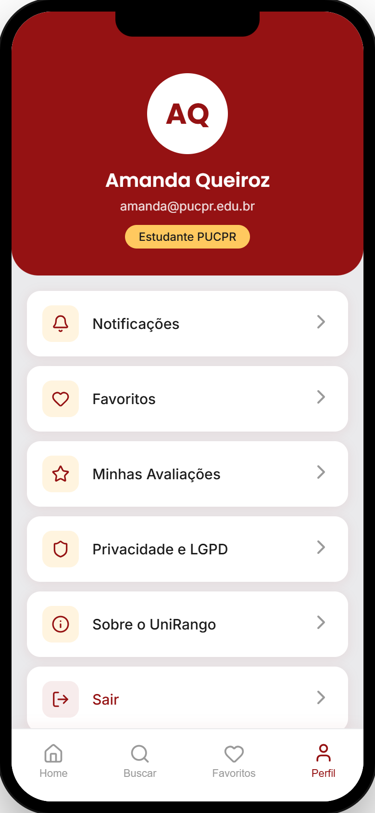
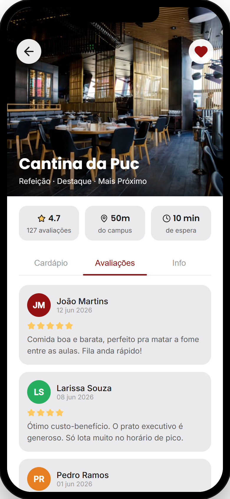
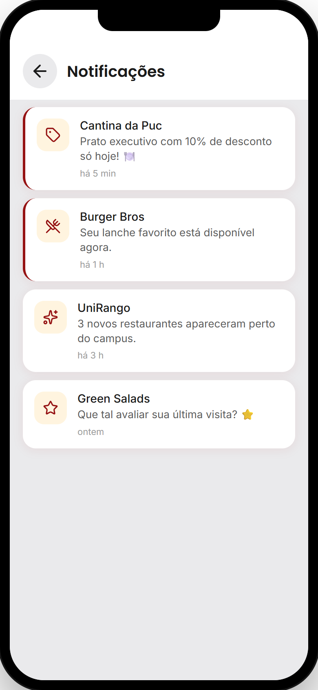

# Documentação de Design — UniRango

> **UniRango** — *Coma bem, gaste menos.*
> Aplicativo mobile para estudantes da PUCPR encontrarem restaurantes próximos ao campus.
>
> Este documento registra as **definições**, as **decisões de design** e os **ajustes**
> realizados ao longo do desenvolvimento.

<br>

<p align="center">
  
  &nbsp;&nbsp;
  
  &nbsp;&nbsp;
  
</p>

---

## Sumário

1. [Contexto e problema](#1-contexto-e-problema)
2. [Definições do projeto](#2-definições-do-projeto)
3. [Pesquisa e descobertas](#3-pesquisa-e-descobertas)
4. [Definição de identidade visual](#4-definição-de-identidade-visual)
5. [Decisões de design e UX](#5-decisões-de-design-e-ux)
6. [Arquitetura de informação e fluxos](#6-arquitetura-de-informação-e-fluxos)
7. [Decisões de cada tela](#7-decisões-de-cada-tela)
8. [Ajustes feitos durante o desenvolvimento](#8-ajustes-feitos-durante-o-desenvolvimento)

---

## 1. Contexto e problema

O projeto nasceu de uma dor concreta do cotidiano universitário: **estudantes perdem tempo
procurando onde comer entre as aulas**, sem saber de antemão preço, cardápio, distância ou
tempo de espera dos estabelecimentos ao redor do campus.

As alternativas existentes (apps de delivery genéricos, grupos de WhatsApp, "boca a boca")
não atendem bem esse cenário porque:

- são pensadas para **entrega em casa**, não para quem vai comer no local entre aulas;
- não consideram a **proximidade ao campus** como critério central;
- não trazem **avaliações de quem realmente frequenta** aqueles lugares.

**Hipótese de design:** um app focado em proximidade do campus, com informação rápida
(preço, distância, tempo) e avaliações de colegas, reduz o atrito da decisão "onde comer hoje?".

---

## 2. Definições do projeto

### 2.1 Objetivo

Ajudar estudantes da PUCPR a decidir rapidamente onde comer perto do campus, reunindo num só lugar preço, distância, tempo de espera e avaliações reais.

### 2.2 Público-alvo

Estudantes universitários da **PUCPR (Curitiba — Prado Velho)**, com rotina corrida e orçamento
limitado, que precisam de decisões rápidas sobre alimentação durante o dia letivo.

### 2.3 Escopo definido

| Dentro do escopo |
|------------------|
| Fluxo de entrada (splash, onboarding, login) |
| Descoberta de restaurantes (home, busca, filtros) |
| Detalhe do restaurante (cardápio, avaliações, info) |
| Favoritos e perfil |
| Páginas de apoio (notificações, LGPD, sobre) |

### 2.4 Princípios de design adotados

1. **Rapidez acima de tudo** — a informação essencial (preço, distância, tempo) precisa aparecer
   logo no primeiro olhar do card.
2. **Mobile-first real** — desenhado para uma mão e telas pequenas, em moldura de celular.
3. **Familiaridade** — usar padrões já conhecidos de apps de comida (abas inferiores, cards,
   busca com filtros) para reduzir a curva de aprendizado.
4. **Confiança** — avaliações de colegas e transparência de dados (LGPD) como elementos de prova social.
5. **Identidade própria** — visual reconhecível, não genérico.

---

## 3. Pesquisa e descobertas

Antes de desenhar, foram levantadas as necessidades dos usuários (entrevistas informais e
observação de rotina no campus). As principais descobertas que guiaram o design:

| Descoberta | Implicação no design |
|------------|----------------------|
| "Quero saber o preço **antes** de ir até lá." | Faixa de preço sempre visível no card. |
| "Não tenho tempo de andar muito." | Distância em destaque (badge no card e pill no detalhe). |
| "Fila grande me faz desistir." | Campo "tempo de espera" no card e no detalhe. |
| "Confio na opinião de quem estuda aqui." | Avaliações com nome e nota em destaque. |
| "Sempre volto nos mesmos lugares." | Funcionalidade de **favoritos** de acesso rápido. |
| "Uso o celular com uma mão só, correndo." | Navegação por **abas inferiores** ao alcance do polegar. |

---

## 4. Definição de identidade visual

### 4.1 Nome e slogan

- **UniRango** — junção de *Universidade* + *Rango* (gíria brasileira para comida/refeição).
  Comunica de forma direta e informal o propósito: comida no contexto universitário.
- **Slogan:** *"Coma bem, gaste menos."* — resume os dois benefícios centrais (qualidade + economia).

### 4.2 Logotipo

Decidiu-se por uma **marca própria desenhada em SVG**, em vez de usar um ícone genérico, para dar
personalidade ao app. A marca combina **garfo + colher estilizados** (alimentação) com um detalhe
circular âmbar (ponto de destaque/localização), sobre fundo vinho arredondado.

### 4.3 Paleta de cores

A escolha das cores foi intencional para transmitir **apetite, energia e confiança**:

| Cor | Hex | Significado / uso |
|-----|-----|-------------------|
| **Vinho** | `#951213` | Cor primária. Remete a apetite e à tradição gastronômica; transmite seriedade e identidade forte. Usada em botões, destaques e elementos ativos. |
| **Âmbar** | `#ffc95f` | Cor de acento. Traz calor, energia e contraste amigável. Usada em badges, favoritos e indicadores. |
| **Cinza claro** | `#eaeaec` | Fundo neutro que faz os cards brancos "flutuarem". |
| **Tons de texto** | `#1a1a1a` / `#5a5a5a` / `#9a9a9a` | Hierarquia tipográfica em três níveis (principal, secundário, terciário). |

> **Decisão:** evitar verde/vermelho saturados (associados a delivery genérico) e construir uma
> paleta vinho + âmbar que fosse quente, mas distinta.

### 4.4 Tipografia

- **Poppins** (peso 600/700) para títulos — geométrica e amigável, dá personalidade.
- **Inter** (peso 400/500) para textos e interface — alta legibilidade em tamanhos pequenos.

Combinar uma fonte expressiva (títulos) com uma neutra (corpo) é uma decisão clássica que
equilibra identidade e clareza.

<table>
<tr>
<td width="240"></td>
<td>

A **tela de abertura** reúne toda a identidade visual definida: o **logotipo** (garfo + colher
com detalhe âmbar), o fundo na cor primária **vinho**, o título em **Poppins** e o slogan em
**Inter**. É a primeira impressão de marca do app.

</td>
</tr>
</table>

### 4.5 Linguagem visual (tokens)

Para garantir consistência, foi definido um **Design System** com *design tokens*:

- **Cantos arredondados** em três escalas: cards (16px), superfícies grandes (24px) e
  elementos "pill" (totalmente arredondados) — transmitem suavidade e modernidade.
- **Sombras suaves em tom vinho** (não preto puro) para integrar a elevação à paleta.
- **Espaçamentos e tamanhos padronizados** reaproveitados em todas as telas.

---

## 5. Decisões de design e UX

### 5.1 Moldura de celular na tela

**Decisão:** exibir o app dentro de uma **moldura realista de smartphone** (com notch),
centralizada na tela, em vez de ocupar a janela inteira.

**Motivo:** reforça que se trata de um app mobile, melhora a apresentação do protótipo em
demonstrações e mantém a fidelidade do design independente do tamanho do monitor (a moldura é
**escalada proporcionalmente**, nunca distorcida).

### 5.2 Navegação por abas inferiores

**Decisão:** quatro abas fixas na base — **Home, Buscar, Favoritos, Perfil**.

**Motivo:** padrão consagrado em apps mobile; mantém as áreas principais sempre ao alcance do
polegar e dá previsibilidade. Acessar uma aba principal **reinicia o histórico de navegação**,
evitando pilhas confusas no botão "voltar".

### 5.3 Transições estilo app nativo

**Decisão:** telas entram/saem com **deslize horizontal** (slide), não troca seca.

**Motivo:** reforçar a sensação de aplicativo nativo e dar continuidade espacial entre telas
(a tela nova "empurra" a anterior).

### 5.4 Hierarquia de informação nos cards

**Decisão:** cada card de restaurante prioriza, nesta ordem: **foto → nome → categoria →
nota + tempo → faixa de preço**, com **distância como badge sobre a foto**.

**Motivo:** alinhar diretamente às descobertas da pesquisa (preço, distância e tempo são
decisivos). O usuário decide sem precisar abrir o detalhe.

<table>
<tr>
<td>

Na **tela inicial**, repare como cada card mostra de imediato a **distância** (badge sobre a
foto), a **nota**, o **tempo de espera** e a **faixa de preço** — exatamente os dados decisivos.
A home ainda combina o **carrossel horizontal** ("Próximos a você") com os **cards de destaque**
verticais.

</td>
<td width="240"></td>
</tr>
</table>

### 5.5 Três formatos de card para três contextos

- **Card horizontal** (carrossel "Próximos a você") — descoberta rápida por scroll lateral.
- **Card de destaque** (vertical, "Destaques") — dá protagonismo a estabelecimentos selecionados.
- **Card de lista** (busca e favoritos) — compacto, otimizado para varredura vertical.

**Motivo:** o mesmo dado ganha o formato mais eficiente para cada tarefa.

### 5.6 Busca com filtros combináveis

**Decisão:** filtros de **distância, preço, tipo e avaliação** que abrem um *drawer* de opções e
podem ser combinados, com rótulo refletindo a seleção e opção de "Limpar".

**Motivo:** dar controle real ao usuário sem poluir a tela — os filtros ficam recolhidos até
serem acionados.

<table>
<tr>
<td width="240"></td>
<td>

A **tela de busca** mostra os filtros recolhidos no topo; ao tocar em um deles (ex.: **Preço**),
abre-se o *drawer* com as opções e o botão **Limpar**. Os resultados, em **cards de lista**
compactos, atualizam em tempo real conforme a busca e os filtros aplicados.

</td>
</tr>
</table>

### 5.7 Favoritos com feedback imediato

**Decisão:** o coração anima ao ser tocado, mostra um **toast** de confirmação e o estado é
**sincronizado em todas as telas** ao mesmo tempo.

**Motivo:** feedback imediato gera confiança na ação; a sincronização evita inconsistências
(favoritar na home e ver refletido no detalhe e na aba Favoritos).

### 5.8 Estados vazios cuidados

**Decisão:** telas sem conteúdo (sem favoritos, sem resultado de busca) mostram **ilustração +
mensagem + ação sugerida**, em vez de uma tela em branco.

**Motivo:** orientar o usuário e reduzir a sensação de "erro" ou app quebrado.

### 5.9 Transparência de dados (LGPD)

**Decisão:** incluir uma página dedicada de **Privacidade e LGPD** (Lei nº 13.709/2018).

**Motivo:** lidar com localização e e-mail institucional exige transparência; isso também
gera confiança no público acadêmico.

---

## 6. Arquitetura de informação e fluxos

### 6.1 Estrutura de telas

```
Entrada            Principais (abas)        Detalhe / Apoio
─────────          ─────────────────        ───────────────
Splash             Home                     Detalhe do restaurante
Onboarding         Buscar                   Notificações
Login/Cadastro     Favoritos                Minhas Avaliações
                   Perfil                   Privacidade e LGPD
                                            Sobre o UniRango
```

### 6.2 Fluxo principal de uso

```
Splash → Onboarding → Login ─┬─ Entrar / Criar conta ─→ Home
                             └─ Continuar como visitante ─→ Home

Home ⇄ Buscar ⇄ Favoritos ⇄ Perfil        (abas inferiores)
  │                              │
  └─→ Detalhe do restaurante     └─→ Notificações · Avaliações · Privacidade · Sobre
```

**Decisão de fluxo:** oferecer **modo visitante** já no login, removendo a barreira de cadastro
para o primeiro contato — alinhado ao princípio de "rapidez acima de tudo".

---

## 7. Decisões de cada tela

| Tela | Decisão de design | Por quê |
|------|-------------------|---------|
| **Splash** | Tela cheia em vinho com logo, slogan e botão único. | Primeira impressão de marca, simples e direta. |
| **Onboarding** | 3 slides com ilustrações próprias (SVG) + opção "Pular". | Comunicar valor rapidamente sem obrigar a leitura. |
| **Login/Cadastro** | Abas alternáveis (Entrar/Criar conta) na mesma tela + visitante. | Menos telas, menos atrito; campos aparecem conforme o modo. |
| **Home** | Saudação personalizada, busca, categorias e duas seções (próximos/destaques). | Descoberta imediata; o conteúdo mais relevante "acima da dobra". |
| **Buscar** | Busca em tempo real + filtros recolhíveis + lista de resultados. | Controle e precisão para quem já sabe o que procura. |
| **Favoritos** | Lista dos salvos com estado vazio orientativo. | Acesso rápido aos lugares recorrentes. |
| **Perfil** | Cabeçalho com avatar/badge + menu de acessos + sair. | Centralizar conta e configurações de forma familiar. |
| **Detalhe** | Hero com foto, "quick pills" (nota/distância/tempo) e abas Cardápio/Avaliações/Info. | Toda a informação de decisão organizada e escaneável. |
| **Privacidade/Sobre** | Páginas de texto com hierarquia clara. | Transparência e credibilidade. |

### Galeria de telas

<table>
<tr>
<td align="center"><br/><sub><b>Splash</b></sub></td>
<td align="center"><br/><sub><b>Onboarding</b></sub></td>
<td align="center"><br/><sub><b>Login / Cadastro</b></sub></td>
</tr>
<tr>
<td align="center"><br/><sub><b>Home</b></sub></td>
<td align="center"><br/><sub><b>Buscar + filtros</b></sub></td>
<td align="center"><br/><sub><b>Favoritos</b></sub></td>
</tr>
<tr>
<td align="center"><br/><sub><b>Perfil</b></sub></td>
<td align="center"><br/><sub><b>Detalhe — Cardápio</b></sub></td>
<td align="center"><br/><sub><b>Detalhe — Avaliações</b></sub></td>
</tr>
<tr>
<td align="center"><br/><sub><b>Notificações</b></sub></td>
<td></td>
<td></td>
</tr>
</table>

---

## 8. Ajustes feitos durante o desenvolvimento

Registro das principais mudanças e refinamentos ao longo da construção do protótipo:

1. **Cabeçalhos com botão "voltar" padronizados.**
   *Ajuste:* criação de variações de cabeçalho consistentes para as telas internas.
   *Motivo:* o usuário sempre sabe como retornar.

2. **Responsividade por escala da moldura.**
   *Antes:* a moldura podia "estourar" em janelas pequenas.
   *Ajuste:* a moldura inteira passou a ser **escalada proporcionalmente** conforme o tamanho da
   janela.
   *Motivo:* preservar a fidelidade do design mobile em qualquer tela.

3. **Inclusão da página de LGPD.**
   *Ajuste:* adicionada após a definição de que o app lidaria com localização e e-mail.
   *Motivo:* conformidade e confiança.
